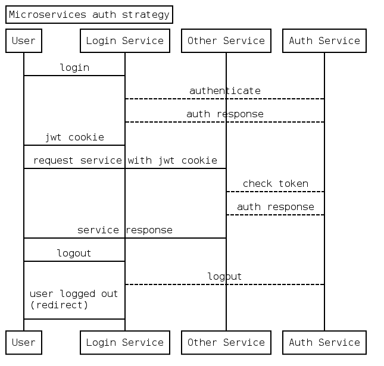

# Auth strategy

Use: [https://bramp.github.io/js-sequence-diagrams/](https://bramp.github.io/js-sequence-diagrams/)

```
Title: Microservices auth strategy
Participant User
Participant Login Service as Login
Participant Other Service as Other
Participant Auth Service as Auth
User->Login: login
Login-->Auth: authenticate
Auth-->Login: auth response
Login->>User: jwt cookie
User->Other: request service with jwt cookie
Other-->Auth: check token
Auth-->Other: auth response
Other->>User: service response
User->Login: logout
Login-->Auth: logout
Login->>User: user logged out\n(redirect)
```



## Server info

[README.md](./server/README.md)
